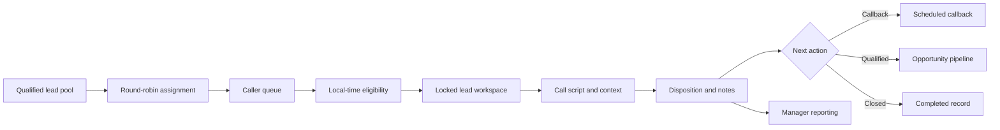

# Customer Reactivation Operations

**A multi-user calling workspace that turns dormant customer records into a controlled, accountable reactivation process.**

`Next.js` · `TypeScript` · `Supabase` · `PostgreSQL` · `Operations Design`

## At a glance

| | |
|---|---|
| **Business problem** | Callers lacked a shared workflow for context, ownership and follow-up |
| **Primary users** | Callers and operations managers |
| **System role** | Queue work, protect records, capture outcomes and manage follow-up |
| **AI role** | Optional conversation summarization support |
| **Control model** | Authentication, assignments, locks, local-time guards and role-limited management |

## The problem

Reactivation fails when lead lists are passed around without ownership,
conversation context or consistent outcomes. Callers duplicate work, contact
people at the wrong time and leave callbacks in personal notes.

I designed a shared operating workspace that makes the next action explicit and
preserves the history required by both callers and managers.

## How it works

## Core capabilities

- Authenticated multi-user caller workspace
- Assigned queues and round-robin distribution
- Historical context and consistent call scripts
- Local-time calling eligibility
- Record locks that reduce duplicate handling
- Standard dispositions, notes and callbacks
- Follow-up email tracking
- Pipeline stages from first attempt through retained opportunity
- Manager-only assignment, settings and performance views
- Caller and team reporting with export support
- Optional alert webhooks and booking-link integration

## Technology stack

| Layer | Technology |
|---|---|
| Application | Next.js and React |
| Language | TypeScript |
| Data and auth | Supabase / PostgreSQL |
| Styling | Tailwind CSS |
| Email | Nodemailer integration |
| Deployment evidence | Vercel configuration |

## Key design decisions

1. Make ownership explicit before a caller opens a record.
2. Store every touch as structured operational history.
3. Treat callbacks as scheduled work, not free-text reminders.
4. Separate caller workflows from manager controls.
5. Enforce local-time rules before encouraging contact.

## My contribution

I translated the reactivation process into roles, queues, statuses and manager
controls; defined the caller experience and safety rules; and directed the
AI-assisted implementation of the working application.

## Further documentation

- [Architecture](docs/architecture.md)
- [Capabilities](docs/capabilities.md)
- [Design decisions](docs/design-decisions.md)
- [Evidence boundaries](docs/evidence.md)
- [Fictional call workflow](examples/fictional-workflow.md)

## Public repository boundary

This case study excludes lead identities, phone numbers, scripts, credentials,
production records, internal targets and original private source code.

